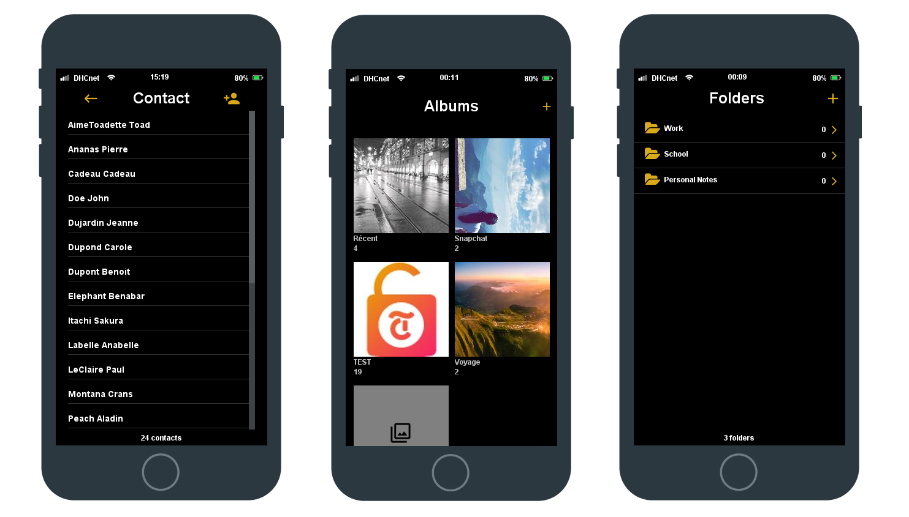

<div align="center">
            <a href="https://gitlab.com/d-roduit/projet-smartphone-dhc/"></a>

#

<p align="center">
    <strong>A client-side Java smartphone emulator to display and interact with your applications</strong>
</p>

</div>


<div align="center">
    <a href="https://gitlab.com/d-roduit/projet-smartphone-dhc/"></a>
</div>
<br>

<!--  -->

The DHC project's goal is to create and simulate a smartphone with applications such as contacts, picture gallery and notes.

The technology used for this project is based on Java Swing and libraries such as Jackson, Junit, Flatlaf and jIconFont.   


## Table of Contents

1. [Getting Started](#getting-started)
2. [Running the tests](#running-the-tests)
3. [Deployment](#deployment)
4. [Authors](#authors)
5. [Guides and resources](#guides-and-resources)
6. [License](#license)

## <a name="getting-started"></a>Getting Started

Once you have downloaded your copy of the DHC project, you will have to enter the paths of the files which will be used for this project in the config file.

Below you will find an example of the config file : 
```json
{
    "notesFolderPath": "Absolute_path_to_your_notes_folder",
    "contactsFolderPath": "Absolute_path_to_your_contacts_folder",
    "picturesFolderPath": "Absolute_pathh_to_your_pictures_folder"
}
```


### Prerequisites

You will need the following folders / files to install the applications and be able to run it on your system:

- Smartphone.jar
- Contact.json
- Note Folder
- Picture folder

### Installing

A step by step series of examples that tell you how to get a development env running

Say what the step will be

```
Give the example
```

And repeat

```
until finished
```

End with an example of getting some data out of the system or using it for a little demo


## <a name="deployment"></a>Deployment

Add additional notes about how to deploy this on a live system

## <a name="authors"></a>Authors

<table>
   <tbody>
      <tr>
         <td align="center" valign="top" width="11%">
            <a href="https://github.com/d-roduit">
            <br />
            Daniel Roduit
            </a>
         </td>
         <td align="center" valign="top" width="11%">
            <a href="https://gitlab.com/g.cathy">
            <br />
            Cathy Gay
            </a>
         </td>
         <td align="center" valign="top" width="11%">
            <a href="https://gitlab.com/Henrick_Neads">
            <br />
            Henrick Neads
            </a>
         </td>
      </tr>
   </tbody>
</table>

## <a name="guides-and-resources"></a>Guides and resources

* [Java Swing](https://docs.oracle.com/javase/8/docs/technotes/guides/swing/index.html) - Swing
* [FlatLaf](https://www.formdev.com/flatlaf/) - Flat Look and Feel
* [jIconFont](http://jiconfont.github.io/) - API to provide icons generated by any IconFont
* [Jackson](https://github.com/FasterXML/jackson) - Jackson JSON Parser
* [Maven](https://maven.apache.org/) - Dependency Management


## <a name="license"></a>License

This project is licensed under the MIT License
