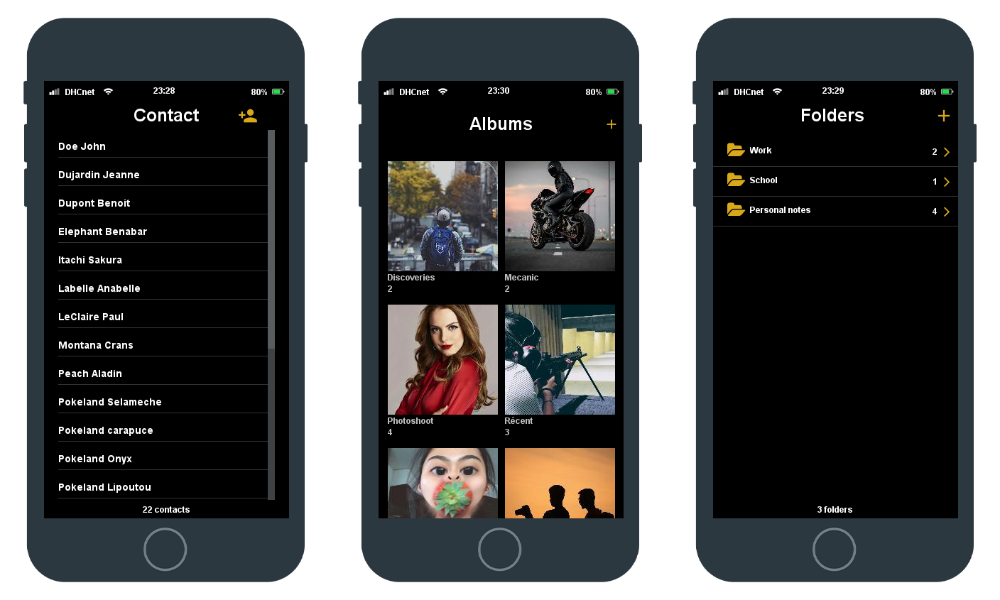

<div align="center">
   <a href="https://github.com/d-roduit/DHC-Phone"></a>

#

<p align="center">
    <strong>A client-side Java smartphone emulator to display and interact with your applications 📱</strong>
</p>

</div>

<div align="center">
    <a href="https://github.com/d-roduit/DHC-Phone"></a>
</div>
<br>

The goal of this project was to create and simulate a smartphone with applications such as contacts, picture gallery and notes.

It was made in order to learn the Swing framework.

## Table of Contents

1. [Getting Started](#getting-started)
2. [Technologies](#technologies)
3. [Guides and resources](#guides-and-resources)
4. [Authors](#authors)
5. [License](#license)

## <a name="getting-started"></a>Getting Started

### Running

There are two ways to run the project :

1. **Run the JAR:** The first and fastest way is to simply download the JAR from the [releases section](https://github.com/d-roduit/DHC-Phone/releases) and run it with the command `java -jar DHC-Phone.jar`.
2. **Run the project with your editor:**
    1. Download the project files to your computer and open the project in your favorite IDE (Eclipse, IntelliJ IDEA, etc.).
    2. Download the project dependencies with Maven. _(This step is often proposed or performed automatically by the IDE)_
    3. Run the project. The starting class is `ch.dhc.Main`.
    
Once you successfully ran the project, you will be able to use the pre-installed applications !

### <a name="prerequisites"></a>Configure applications folder paths [Optional]

By default, when you first run the smartphone, the pre-installed applications will contain no data. The smartphone will therefore create a config file (`config.json`) and folders to hold future data for each application. These elements will be created at the same location than the JAR.

If you want the smartphone applications to use already existing data, for example a folder full of pictures that the picture application could use, you can use the `config.json` file to specify to the smartphone the folder you want to use for the pictures.

The `config.json` file must be placed at the root of the folder that contains the JAR.

Here is the configuration file :
```json
{
    "notesFolderPath": "Absolute_path_to_your_notes_folder",
    "contactsFolderPath": "Absolute_path_to_your_contacts_folder",
    "picturesFolderPath": "Absolute_path_to_your_pictures_folder"
}
```

**:warning: The absolute paths must obligatorily finish with `/` or `\\`.**

### How to use

All the actions you can do with the smartphone are copied from a real iPhone.

Possible actions :
- **Turn the screen on** : click on the home button OR click on the lock button (top right button).
- **Turn the screen off** : click on the lock button.
- **Stop the program** : Long press on the lock button.
- **Run an application** : Click on an app icon.
- **Open the application manager** : double click on the home button.
- **Go back to home** : click on the home button.

## <a name="technologies"></a>Technologies

This project relies entirely on Java.

The smartphone and applications have been made with Swing.

The front-end also uses the following libraries :

- Flatlaf
- jIconFont

The back-end uses the following libraries :

- Jackson
- JUnit

## <a name="guides-and-resources"></a>Guides and resources

* [Java Swing](https://docs.oracle.com/javase/8/docs/technotes/guides/swing/index.html) - Graphical library for Java
* [FlatLaf](https://www.formdev.com/flatlaf/) -  Modern open-source cross-platform Look and Feel for Java Swing
* [jIconFont](http://jiconfont.github.io/) - API to provide icons generated by any IconFont
* [Jackson](https://github.com/FasterXML/jackson) - JSON serialization/deserialization library for Java
* [JUnit](https://junit.org/junit5/) - Testing framework for Java
* [Maven](https://maven.apache.org/) - Software project management and comprehension tool

## <a name="authors"></a>Authors

<table>
   <tbody>
      <tr>
         <td align="center">
            <a href="https://github.com/d-roduit">
            <br />
            Daniel Roduit
            </a>
         </td>
         <td align="center">
            <a href="https://gitlab.com/g.cathy">
            <br />
            Cathy Gay
            </a>
         </td>
         <td align="center">
            <a href="https://gitlab.com/Henrick_Neads">
            <br />
            Henrick Neads
            </a>
         </td>
      </tr>
   </tbody>
</table>

## <a name="license"></a>License

This project is licensed under the MIT License
